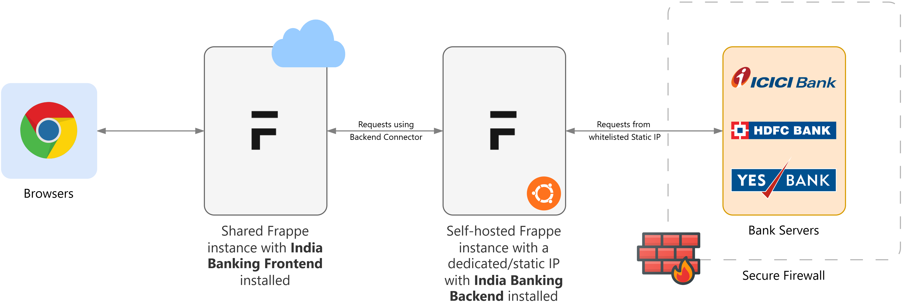
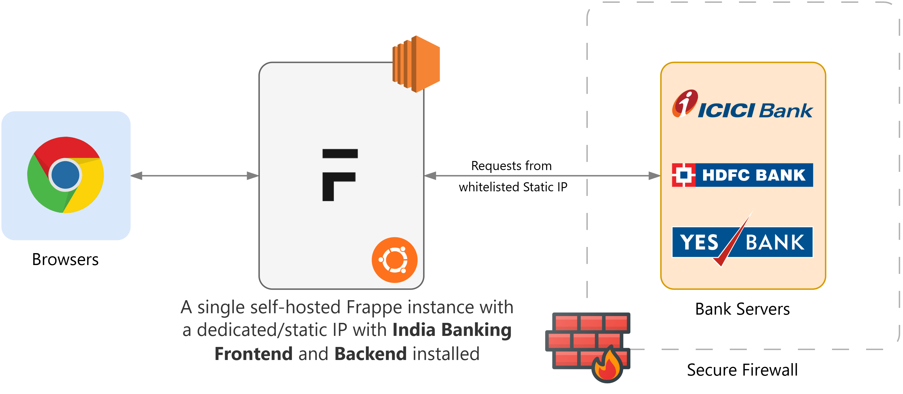

# India Banking Integration for ERPNext

## Introduction

Integrating banking payments into ERPNext streamlines financial management, making it easier to pay vendors, employees, handle payroll, and reconcile bank statements (if supported by the bank). This automation reduces manual processing errors and simplifies payment entries.

Currently, this integration is available with select Indian banks, and it is accessible to account holders upon request. After a year of efforts to gain API access, we've identified current account holders with good transactional histories. As banks offer more robust APIs and simplify the API access process, we are developing a custom Frappe app called **India Banking** to facilitate this integration.

The ERPNext banking payment flow and necessary customizations are handled within the India Banking app, which connects to the available server-side apps.

Due to strict bank security requirements (static IPs, certificates, and specific environments), the server-side app structure is essential. This scheme is detailed in the usage section.

### Deployment Options

- **Private Benches or Dedicated Servers**: Install both the India Banking client and server app on the same site if a static IP is available.
- **Shared Benches**: Install the India Banking client app on a Frappe Cloud site and manage certificates and keys on a hosted server with a static IP.
- **On-Premise Setup**: Install both the client and server-side apps on the same site.

### Supported Banks and Status

- **ICICI Bank Server App**: API integration live.
- **HDFC Bank Server App**: API integration live.
- **Yes Bank Server App**: API integration live.
- **Axis Bank Server App**: API integration live.
- **Kotak Mahindra Bank Server App**: API integration live.
- **Bank of Baroda**: In UAT phase.
- **SBI Server App**: Awaiting API access.
- **Standard Chartered Bank Server App**: Awaiting API access.

## Bank-Specific Features

### ICICI Bank

- **Transfers**: IMPS, NEFT, RTGS, Internal Transfer (Single API with portal authorization).
- **Bulk Transfers**: NEFT (Bulk API with single OTP and portal authorization).
- **Encryption**: AES, RSA.

### HDFC Bank

- **Transfers**: IMPS, NEFT, RTGS, A2A (Single API with and without portal authorization).
- **Encryption**: (AES, RSA, Signature Validation) or JSON Object Signing and Encryption - application/jose.

### Yes Bank

- **Transfers**: IMPS, NEFT, RTGS, A2A (Single API without portal authorization).
- **Encryption**: Signature Validation.

### Axis Bank

- **Transfers**: IMPS, NEFT, RTGS, A2A (Single API with and without portal authorization).
- **Encryption**: Checksum Validation, AES (Key provided by the bank).

### Kotak Mahindra Bank

- **Transfers**: IMPS, NEFT, RTGS, A2A (Single API with and without portal authorization).
- **Encryption**: AES, RSA.

## Overview & Terminology

The India Banking application has two modules: server-side and client-side. The source code in this repository contains the client-side module. This might be confusing at the first glance but the client-server nomenclature is to distinguish the systems involved for API communincation with the banks. These can also be called _frontend_ and _backend_ respectively.

Both _frontend_ and _backend_ are essentialy Frappe instances with the appropriate India Banking apps installed on them. These can be two separate instances or a single instance, as detailed in the Deployment section above. In case of a shared deployment or when a static IP is not available but required by the bank API, use a split deployment model as detailed above. If the main instance that the clients interact with is already deployed on a dedicated server with a static IP, both the frontend and backend are installed on the same machine.

These diagrams should give an idea of the different schemes of deployment:

An example split deployment with a dedicated Frappe instance installed on an Ubunutu machine with static IP.

An example shared deployment with the dedicated Frappe instance installed on an AWS EC2 virtual machine with static IP, running Ubunutu.

### Client (Frontend)

The frontend app is the one that the users/customers interact with through their browsers. As such, almost all of the user-facing actions, buttons, and screens are part of the frontend. **This repository contains the code of the frontend app of India Banking.**

The function of the frontend is to to communicate with the India Banking backend, which could be the same instance as the frontend, as detailed above. This communication is done through the **Backend Connector**. The frontend submits the banking operation requested by the user, such as fetching the balance, making payments, etc., to the backend. The functionality of the backend is outlined in the next section.

The usage of the frontend app is detailed [in the documentation](docs/usage.md).

### Server (Backend)

The backend app is the one that talks with the bank's API server to perform the required action requested by the frontend. The backend relays this request to the bank using the appropriate bank connector. The instance on which the backend app is installed should have a static IP that is authorized and whitelisted with the bank, since only the requests coming from that instance for a given bank account are processed and satisfied by the bank's API server.

The code for the backend app is in the [india-banking-connector](https://github.com/aerele/india-banking-connector) repository, and its usage is detailed [in the documentation](docs/usage.md).

## Future Plans

We plan to develop a self-help support portal to assist account holders in providing technical information required by the banks. This portal will include support-related details and a user guide wiki.

## Contact

For more details or assistance, feel free to reach out:

**Vignesh Sekar**
Phone: +91-7790844832
Email: [vignesh@aerele.in](mailto:vignesh@aerele.in)
