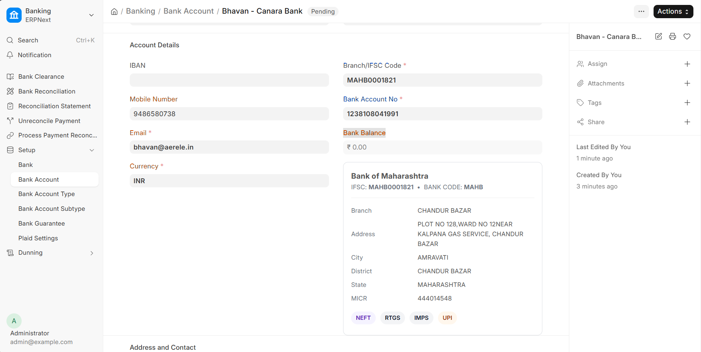

# Bank Account

## Overview

ERPNext's Bank Account doctype stores account details for companies and parties (suppliers, employees, customers). Out of the box it handles GL account linking, default account flags, and basic party association.

`india_banking` extends it for Indian banking requirements: IFSC validation, live balance display, payment notification contacts, currency enforcement, an IFSC auto-populate feature via the Razorpay IFSC API, and an approval workflow to control which accounts can be used for bulk payments.

---

## Form Preview



| Highlight | Meaning |
|---|---|
| Orange border | Fields **added** by `india_banking` (custom fields + IFSC details card) |
| Blue border | Standard ERPNext fields **modified** by `india_banking` (made required / renamed) |

---

## Custom Fields Added

These fields are added by `india_banking` at install time (`install.py` lines 523–573). They do not exist in standard ERPNext.

| Field | Fieldname | Type | Purpose |
|---|---|---|---|
| Mobile Number | `mobile_number` | Data | Contact number for the account holder — used in payment notifications sent to the party |
| Email | `email` | Data (Email) | Email address for payment confirmations and alerts |
| Bank Balance | `bank_balance` | Currency (read-only) | Displays live account balance fetched from the connected India Banking Connector |
| Currency | `currency` | Link → Currency | Enforces currency at the account level; validated to be INR for bank transfers; auto-set from the party's default currency |
| Bank Details JSON | `bank_details_json` | JSON (hidden) | Stores the raw response from the Razorpay IFSC API — branch name, address, MICR, supported services |
| Bank Details HTML | `bank_details_html` | HTML | Renders the IFSC data visually on the form as a styled card |

---

## Standard Field Changes

`india_banking` also modifies properties of two existing ERPNext fields (`install.py` lines 207–235):

| Field | What Changed | Why |
|---|---|---|
| `branch_code` | Label changed to "Branch/IFSC Code"; made **required** | IFSC is mandatory for all Indian payment modes (NEFT, RTGS, IMPS) — payments fail at the bank API without it |
| `bank_account_no` | Made **required** | A bank account number is needed before any payment can be initiated via a connector |

---

## Validations Added

All validations run in the `validate` doc event hook (`doc_events/bank_account/bank_account.py`). They fire on every save (create and update).

### `strip_whitespace()`
Trims leading/trailing whitespace from `bank_account_no`, `branch_code`, `account_name`, `mobile_number`, and `email`.

**Why:** Copy-paste from bank portals and PDFs often includes invisible whitespace characters. These cause silent mismatches when values are sent to bank APIs (e.g., IFSC lookup or payment initiation).

---

### `validate_special_characters()`
Checks that `account_name`, `bank`, and `bank_account_no` contain only letters, numbers, and single spaces (pattern: `^[A-Za-z0-9]+(?: [A-Za-z0-9]+)*$`).

**Why:** Indian bank APIs reject special characters in beneficiary name and account number fields. Catching this at save time prevents payment failures downstream.

---

### `validate_ifsc_code()`
Validates that `branch_code` matches the RBI IFSC format: 4 uppercase letters + `0` + 6 alphanumeric characters (pattern: `^[A-Z]{4}0[A-Z0-9]{6}$`).

**Why:** All Indian inter-bank transfers (NEFT/RTGS/IMPS) require a valid IFSC. An invalid IFSC causes payment rejections at the bank's API — the error only surfaces after submission, which can delay or block bulk payments.

---

### `validate_unique_acc_no()`
If `India Banking Settings → Enable Unique Account No` is on, throws an error if another active Bank Account has the same `bank_account_no`.

**Why:** Duplicate bank accounts for the same account number create double-payment risk in bulk payment flows. The setting allows enforcement to be turned off in environments where multiple accounts legitimately share a number (rare but possible).

---

### `update_party_transaction_currency()`
Sets the `currency` field automatically:
- For parties (supplier/employee/customer) → reads the party's `default_currency` (or `salary_currency` for employees)
- For company accounts → reads the company's `default_currency`

**Why:** The `currency` field is used downstream to validate that a bank account matches the payment currency. Auto-setting it eliminates manual entry errors and ensures new accounts are always set up correctly.

---

## IFSC Auto-populate

When a Bank Account is **newly created** or the **IFSC code is changed**, `india_banking` calls the Razorpay IFSC API:

```
GET https://ifsc.razorpay.com/{IFSC}
```

The JSON response is stored in `bank_details_json` and rendered in `bank_details_html` on the form, showing:
- Bank name, branch name
- Full address, city, district, state
- MICR code
- Supported services (NEFT, RTGS, IMPS, UPI, SWIFT) as coloured badges

**When it fires:** Only when `doc.branch_code` is set AND (the document is new OR `branch_code` has changed). It does not re-call the API on unrelated saves.

**Failure behaviour:** If the API call fails (network error, invalid IFSC), the error is logged to the Error Log and `bank_details_json` is set to `{}`. The save is not blocked.

---

## Form UI (JS additions)

`bank_account.js` adds the following to the Bank Account form:

### Bank Details Card
Displayed in the `bank_details_html` field for saved documents. Shows the IFSC lookup result as a styled card — branch, address, MICR, and service badges. Shows a warning if no details are available.

### Fetch Balance Button (`Fetch` group)
Appears only on **company accounts** when the linked India Banking Connector has `fetch_bank_balance` enabled.

Calls: `india_banking_connector.get_bank_balance(bank_account_name)` → reloads the form to show the updated `bank_balance`.

### Fetch Statements Button (`Fetch` group)
Appears only on company accounts when the connector has `fetch_bank_statement` enabled.

Opens a dialog to specify a date range, then calls `india_banking_connector.get_bank_statement()`.

### Approval Lock
When `India Banking Settings → Enable Bank Account Workflow` is on, the form becomes **read-only** once `workflow_state == "Approved"`. This prevents accidental edits to approved accounts.

Triggered in three places: `onload`, `refresh` (via async settings check), and `after_workflow_action`.

---

## Approval Workflow

**Controlled by:** `India Banking Settings → Enable Bank Account Workflow`

**Purpose:** Ensures only verified bank accounts can be used in Payment Requests. Prevents employees from adding unverified or fraudulent beneficiary accounts that could be used in bulk payments.

**Flow:**
1. New Bank Account created → starts in Draft/Pending state
2. Finance manager reviews and approves → `workflow_state` moves to `Approved`
3. Only `Approved` accounts pass the `validate_bank_account()` check in Payment Request
4. Once approved, the form is locked to prevent tampering

---

## Key Files

| File | Purpose |
|---|---|
| `india_banking/india_banking/doc_events/bank_account/bank_account.py` | All Python validations and IFSC auto-populate |
| `india_banking/public/js/bank_account.js` | Form UI: bank details card, fetch buttons, approval lock |
| `india_banking/install.py` (lines 207–235, 523–573) | Custom field definitions and property setters |
| `india_banking/overrides/payment_request/payment_request.py` | Uses `validate_bank_account()` to check workflow_state before payment |

---

## v16 Migration — Status: Complete (2026-06-12)

No breaking changes identified. Three code quality fixes were applied:

| Fix | Detail |
|---|---|
| `frappe.log_error` keyword args (`bank_account.py:116`) | Changed from positional to `title=`, `message=` for clarity |
| Operator precedence in `validate()` (`bank_account.py:34–38`) | Hoisted `doc.branch_code` guard to outermost `if` to avoid implicit dependency on validation order |
| `cur_frm` → `frm` (`bank_account.js:10, 120, 201`) | Replaced deprecated global with event `frm` parameter |
