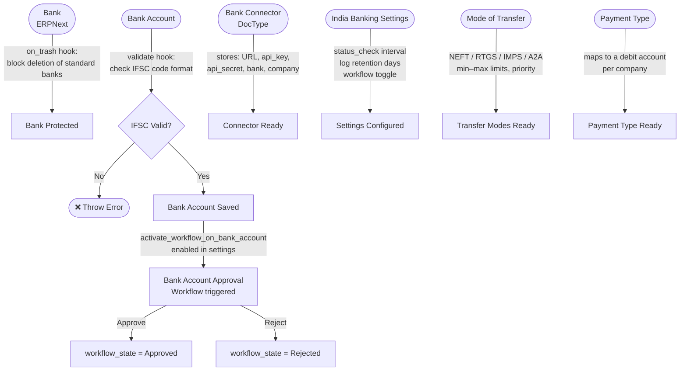
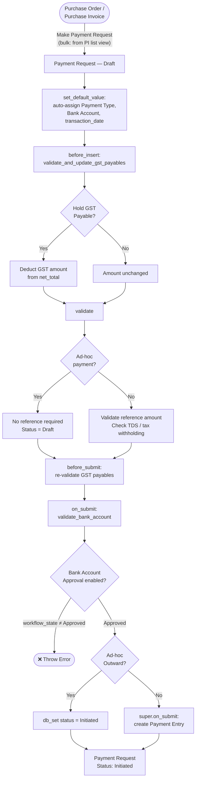
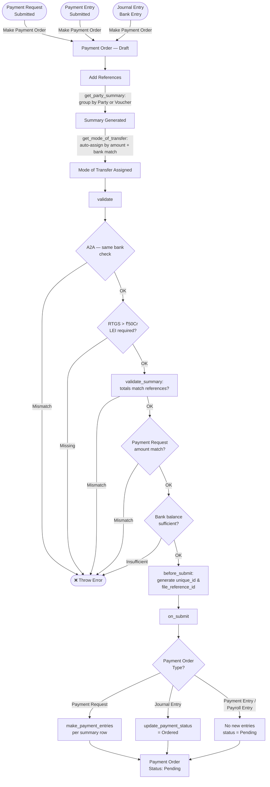
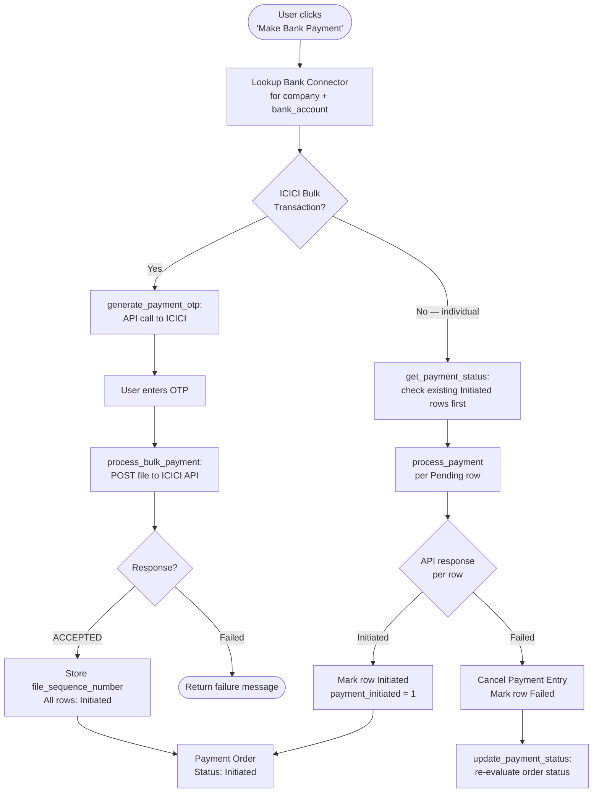
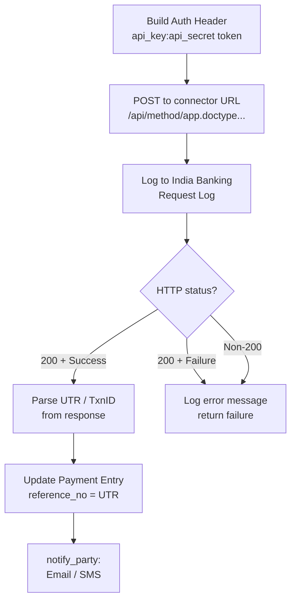
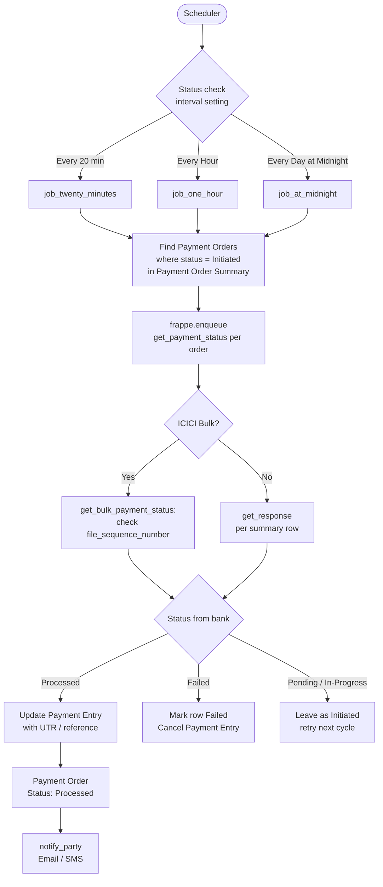
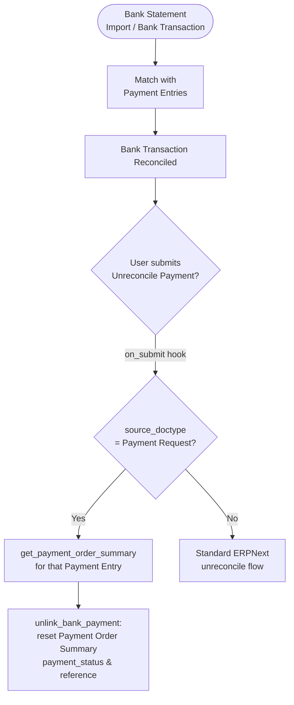
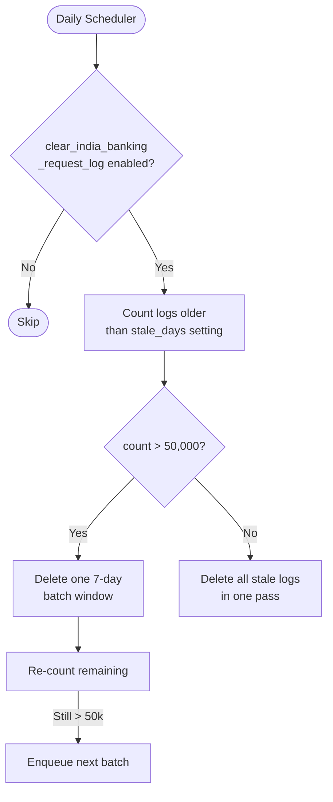

# India Banking — Flow Documentation

## Overview

India Banking integrates ERPNext with Indian banks (ICICI, HDFC, Yes Bank, Axis, Kotak, Bank of Baroda) by overriding standard ERPNext doctypes and adding a Bank Connector layer that proxies API calls to `india_banking_connector`.

---

## 1. Setup & Configuration



---

## 2. Payment Request Flow

> ERPNext's standard **Payment Request** doctype is overridden by `india_banking.overrides.payment_request.BankPaymentRequest`.



---

## 3. Payment Order Flow

> ERPNext's **Payment Order** is overridden by `india_banking.overrides.payment_order.CustomPaymentOrder`.



---

## 4. Initiate Bank Payment



---

## 5. Bank Connector API Layer



---

## 6. Scheduled Payment Status Checks



---

## 7. Reconciliation & Unreconcile



---

## 8. Daily Log Cleanup



---

## Key DocTypes

| DocType | Module | Role |
|---|---|---|
| **Payment Request** | ERPNext (overridden) | Per-invoice payment request; overridden by `BankPaymentRequest` to add TDS, GST hold, bank account approval, ad-hoc support |
| **Payment Order** | ERPNext (overridden) | Batches multiple payment requests into one bank instruction; overridden by `CustomPaymentOrder` |
| **Payment Entry** | ERPNext (overridden) | Accounting entry created on Payment Order submit; extended to carry `source_doctype` |
| **Bank Account** | ERPNext | Company and party bank accounts; IFSC validation + optional approval workflow |
| **Bank Connector** | India Banking | Stores API credentials (URL, key, secret) per company–bank pair |
| **India Banking Settings** | India Banking | Global config: status-check interval, log retention, workflow toggle |
| **Mode of Transfer** | India Banking | NEFT / RTGS / IMPS / A2A with amount limits, priority, and bank-specific rules |
| **Payment Type** | India Banking | Maps a payment category to a debit account per company |
| **Payment Order Summary** | India Banking | One row per party in a Payment Order; tracks `payment_status`, UTR, payment date |
| **India Banking Request Log** | India Banking | Full API request/response audit trail; auto-purged after `stale_days` |
| **Payment Notification** | India Banking | Stores inbound bank webhook/notification events |
| **Unreconcile Bank Payment** | India Banking | Reverse reconciliation and unlink Payment Order Summary on submit |

---

## Payment Request Status Lifecycle

```
Draft → Submitted → Initiated → (via Payment Order) → Processed
                                                    ↘ Failed
```

## Payment Order Status Lifecycle

```
Pending → Initiated → Processed
                   ↘ Failed (partial or full)
```

---

## Supported Banks

| Bank | Mode |
|---|---|
| ICICI Bank | Bulk (file + OTP) and Individual |
| HDFC Bank | Individual |
| Yes Bank | Individual |
| Axis Bank | Individual |
| Kotak Bank | Individual |
| Bank of Baroda | Individual |
