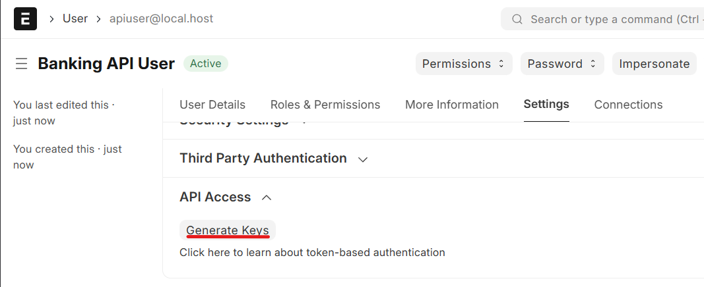
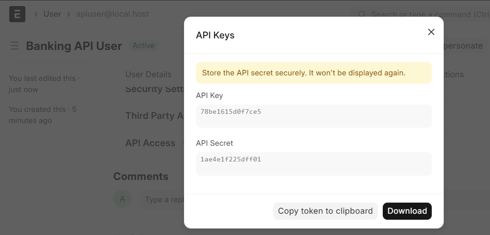
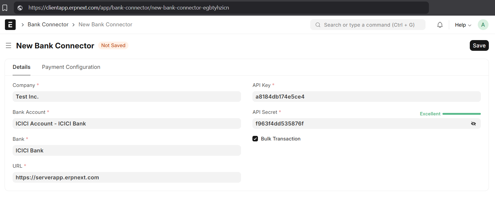
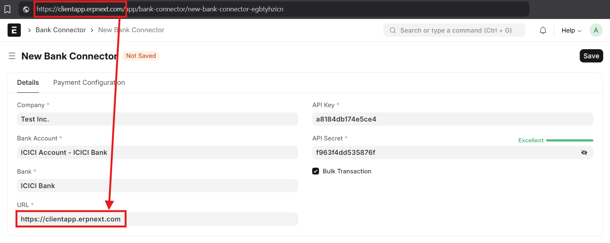

# Usage

## Step 1 - Install and Setup India Banking Client (Frontend)

Install the client/frontend app on the required Frappe instance using:

```console
bench get-app https://github.com/aerele/india-banking --branch <branch-name>

bench --site your.site.name install-app india_banking
```

After the app is installed, run `bench migrate` to make sure the initial values of the associated DocTypes are populated.

Details of all the India Banking client DocTypes and their fields can be found [here](clients/doctypes.md).

## Step 2 - Create a User _on the Backend_

Create a user on the *backend instance* whose API credentials will be used in the next step. In case of a split deployment model, this is an instance that is different from the client. In case of a single deployment, create this user on the same instance above, on which the client/frontend is installed.

Once the user is created, generate the API credentials for the user as shown:





> [!NOTE]
> It is recommended to create and use a separate user for India Banking API usage, instead of using an existing user in the system, to make sure the audit events are properly tracked.

## Step 3 - Create and Setup the Bank Connector

A Bank Connector is the communication channel between the frontend the backend for a company bank account. This means that a Bank Connector should be created for every company bank account that is used to transact *from*, and there can be **only one** Connector per company bank accont.

> [!IMPORTANT]
> Despite what the name might imply, a Bank Connector **does not** communicate with the bank's servers. It is only to signify that the Connector is for a Bank account.

To create a new Bank Connector, search for and select "New Bank Connector" in the Awesome Bar (using Ctrl + G).

In the New Bank Connector form, fill the details as below:

- **Company**: The company whose bank account is to be used in the transactions by this connector.
- **Bank Account**: The Bank Account for which this connector is to be created.
- **Bank**: The bank to which the Bank Account belongs. This is automatically poulated when the Bank Account is selected.
- **URL**: The base URL of the backend instance, with its hostname or IP address. e.g.: https://backend.myerpserver.com or https://192.168.0.1. If the frontend and backend are on the same instance, give the base URL of the same server.
- **API Key**: The API Key of the user created above.
- **API Secret**: The API Secret of the user created above.



In case of a single deployment, the URL should be same as the client app:



## Step 4 - Install and Setup the India Banking Server (Backend)

The backend app and can be installed on the backend instance using:

```console
bench get-app https://github.com/aerele/india-banking-connector --branch <branch-name>

bench --site your.site.name install-app india_banking_connector
```

After the app is installed, run `bench migrate` to make sure the initial values of the associated DocTypes are populated.

## Step 5 - Check Bank API Endpoints
Bank API Endpoints, as the name suggests, define the API endpoints to be called for a particular bank for the requested action. Hence, the required Bank API Endpoints should be created in the system at the get go.

Bank API Endpoints are simply the mappings of predefined actions against the APIs that they are supposed to be performed using. For example, the action of `generate_otp` for ICICI for bulk transactions in production is `https://apibankingone.icicibank.com/api/Corporate/CIB/v1/Create`.

The list of predefined information and action items is:
- `host`: The hostname of the API.
- `make_payment`: The endpoint to make the payment.
- `payment_status`: The endpoint to fetch status.
- `generate_otp`: The endpoint to generate transaction OTP.
- `bank_balance`: The endpoint to fetch bank balance.
- `bank_statement`: The endpoint to fetch bank statement.
- `bank_statement_paginated`: The endpoint to fetch paginated bank statement.
- `oauth_token`: The endpoint to generate and fetch OAuth token.

**Note**: The above list of items may not be applicable to every bank.

To create the list of endpoints for the supported banks, the "**Regenerate API Endpoints**" button on the Bank API Endpoint DocType page (located at `app/bank-api-endpoint`) can be used.

## Step 6 - Check Connector Settings
The Connector Settings DocType contains the mappings for the Connector DocTypes against the respective banks. This is an administrative entity and is a one-time thing that populated when the India Banking backend is installed.

In case the table in the Connector Settings DocType page shows up empty, use the "**Generate Connector Settings**" button on the same page (located at `app/connector-settings`) to generate the Connector Settings.

## Step 7 - Create Bank Connectors
After completing both of the above steps - verifying Bank API Endpoints and Connector Settings (or generating them if required), the next step is to create the Bank Connectors for *each bank account* that is to be transacted with.

Each Connector is a DocType in the system for every bank that is supported. The predefined set of connectors in the system that are supported can be viewed in the Connector Settings DocType page. Example Bank Connectors are ICICI Connector, HDFC Connector, YES Bank Connector, etc.

Each Connector is linked with a bank account and hence should be given its account number during creation. Apart from the bank account, other details such as IFSC Code, the static IP address, etc., might be required, along with the credentials and keys provided by the bank, as well as public and private keys used to encrypt and decrypt the API calls, as required by the banks (such as with ICICI Bank).

## Step 8 - Test
The final step, of course, is to test the API. Fetching account balance and statements can be tested from the Bank Account DocType page from the Bank Account List, making bulk payments can be tested by creating a Payment Order, and so on.

Once the API actions are tested in UAT, the production Connectors can be used to test small amounts in real transactions.
